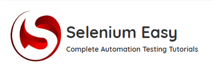

[](https://github.com/FoldiKrizsanIldiko)


[](https://www.linkedin.com/in/ildiko-foldi-krizsan/)

<br />
<div align="center">
     
<h3 align="center">Selenium Easy</h3>
  <p align="center">
Some text needed here
</p>
</div>

<!-- TABLE OF CONTENTS -->
<details>
  <summary>Table of Contents</summary>
  <ol>
    <li>
      <a href="#about-the-project">About The Project</a>
      <ul>
        <li><a href="#built-with">Built With</a></li>
      </ul>
    </li>
    <li>
      <a href="#getting-started">Getting Started</a>
      <ul>
        <li><a href="#installation">Installation</a></li>
      </ul>
    </li>
    <li><a href="#usage">Usage</a></li>
    <li><a href="#contact">Contact</a></li>
  </ol>
</details>


## About The Project

<p>
need some text here
</p>

<p align="right">(<a href="#readme-top">back to top</a>)</p>

### Built With

* 
* 
* 
* 
* 

<p align="right">(<a href="#readme-top">back to top</a>)</p>


## Getting Started

Please follow next steps to run the tests.

### Installation

1. Clone the repo
   ```sh
   git clone https://github.com/FoldiKrizsanIldiko/SeleniumEasyTest3SI.git
   ```
<p align="right">(<a href="#readme-top">back to top</a>)</p>

## Usage

<p align="right">(<a href="#readme-top">back to top</a>)</p>

## Contact

Project
Link: [https://https://github.com/FoldiKrizsanIldiko/SeleniumEasyTest3SI](https://github.com/FoldiKrizsanIldiko/FunFlags)

<p align="right">(<a href="#readme-top">back to top</a>)</p>